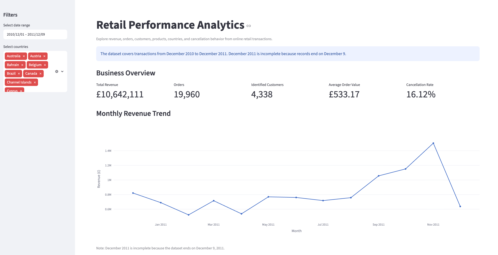
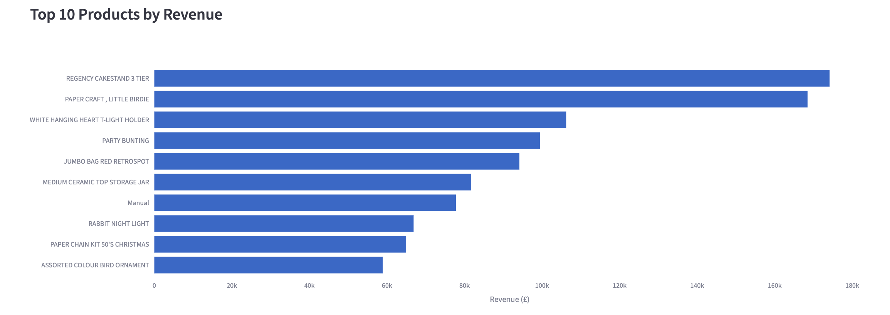
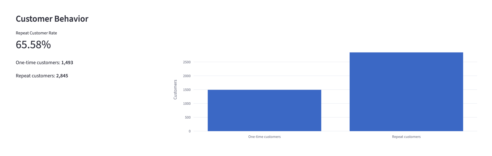
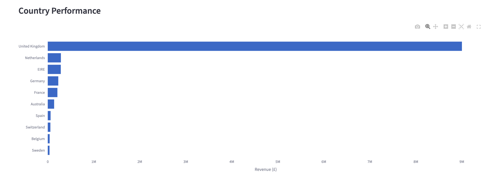

# Retail Performance Analytics

An end-to-end retail analytics project built with Python, Pandas, SQL, SQLite, Plotly, Streamlit, and Pytest.

The project transforms raw transactional data into business insights about revenue, customers, products, countries, and cancellations.

---

## Live Dashboard

[Open the Streamlit Dashboard](https://masri-oussama-retail-performance-analytics-dashboardapp-rh5ovp.streamlit.app/)

---

## Project Overview

This project analyzes online retail transaction data and answers practical business questions such as:

- How does revenue evolve over time?
- Which products generate the most revenue?
- Which countries contribute the most to sales?
- How many customers return for additional purchases?
- How concentrated is revenue among top customers and products?
- What is the cancellation rate?
- Which business areas deserve more attention?

The project covers the complete workflow from raw data to a deployed interactive dashboard.

---

## Dashboard Preview

### Business Overview



### Product Performance



### Customer Behavior



### Country Performance



---

## Business Problem

An online retailer wants to better understand its commercial performance and identify opportunities to improve sales, customer retention, and product strategy.

The main objectives are to:

1. Track revenue and order performance.
2. Identify high-value products.
3. Understand customer purchasing behavior.
4. Compare performance across countries.
5. Monitor cancellations.
6. Transform analytical results into actionable business insights.

---

## Dataset

The project uses the **Online Retail dataset** from the UCI Machine Learning Repository.

The dataset contains transactional information including:

- Invoice number
- Product code
- Product description
- Quantity
- Invoice date
- Unit price
- Customer ID
- Country

The original dataset is not stored directly in this repository because of its size.

Instructions for obtaining and placing the raw dataset are available in:

```text
data/raw/README.md

The deployed Streamlit application uses a compressed processed dataset:

data/dashboard_transactions.csv.gz
Technology Stack
Data Analysis
Python
Pandas
NumPy
Database and SQL
SQLite
SQL
CTEs
Window functions
Aggregations
Visualization
Plotly
Matplotlib
Application
Streamlit
Testing
Pytest
Development
Git
GitHub
Virtual environments
Project Architecture
Raw Online Retail Dataset
            |
            v
    Data Validation
            |
            v
   Python Cleaning Pipeline
   src/data_processing.py
            |
            v
   Processed Transaction Data
            |
      +-----+------+
      |            |
      v            v
 SQLite DB     Exploratory Analysis
      |            |
      v            |
 SQL Queries       |
      |            |
      +-----+------+
            |
            v
    Business Logic Layer
      src/analysis.py
            |
            v
    Streamlit Dashboard
      dashboard/app.py
            |
            v
      Business Insights
Repository Structure
retail-performance-analytics/
│
├── dashboard/
│   └── app.py
│
├── data/
│   ├── raw/
│   │   └── README.md
│   ├── processed/
│   │   └── README.md
│   └── dashboard_transactions.csv.gz
│
├── notebooks/
│   ├── 01_data_understanding.ipynb
│   ├── 02_data_cleaning_validation.ipynb
│   ├── 03_sql_business_analysis.ipynb
│   └── 04_exploratory_analysis.ipynb
│
├── reports/
│   └── figures/
│       ├── dashboard_overview.png
│       ├── top_products.png
│       ├── customer_behavior.png
│       └── country_performance.png
│
├── sql/
│   ├── schema.sql
│   └── business_queries.sql
│
├── src/
│   ├── analysis.py
│   ├── create_dashboard_dataset.py
│   ├── data_processing.py
│   └── database.py
│
├── tests/
│   ├── test_analysis.py
│   └── test_data_processing.py
│
├── .gitignore
├── requirements.txt
└── README.md
Data Cleaning

The raw dataset contains several data-quality issues.

The cleaning pipeline handles:

Exact duplicate rows
Missing customer IDs
Missing product descriptions
Invalid dates
Invalid quantities
Zero or negative prices
Cancellations
Negative quantities
Data type conversion
Important Cleaning Decisions
Missing customer IDs are retained for sales analysis but excluded from customer-level analysis.
Exact duplicates are removed to prevent double counting.
Cancellations are preserved because they contain useful business information.
Negative quantities are not automatically treated as errors because they may represent cancellations, returns, or stock corrections.
Invalid or non-positive prices are excluded from normal sales analysis.
Operational entries such as postage and fees are excluded from product-performance analysis.
Created Business Features

The cleaning pipeline creates additional analytical variables including:

revenue
is_cancellation
year
month
year_month
day_of_week
hour
has_customer_id

Revenue is calculated as:

Revenue = Quantity × Unit Price
SQL Analysis

The processed transactional data is loaded into a local SQLite database.

The SQL analysis includes:

Total revenue
Total number of invoices
Number of identified customers
Average order value
Monthly revenue
Month-over-month growth
Top products by revenue
Top products by quantity
Top customers by revenue
Repeat versus one-time customers
Revenue by country
Average order value by country
Cancellation rate
Cancelled transaction value
Customer ranking within each country
Rolling revenue
Customer revenue concentration
Product cancellation analysis

The queries are available in:

sql/business_queries.sql
Exploratory Data Analysis

The exploratory analysis investigates:

Revenue distribution
Mean versus median
Skewness
Extreme transactions
Monthly revenue trends
Customer concentration
Product concentration
Repeat-customer behavior
Operational entries
Incomplete time periods

The revenue distribution is strongly right-skewed, meaning that a relatively small number of very large transactions strongly influence the average.

Because of this, the median is more representative of a typical transaction line than the mean.

Key Business Findings
Customer Concentration

The top 10% of identified customers generate approximately:

61.45% of identified-customer revenue

This suggests that a relatively small customer segment contributes a large proportion of revenue.

A possible business action would be to monitor these customers closely and develop targeted retention or loyalty strategies.

Product Concentration

After excluding operational entries such as postage and fees, the top 10% of product descriptions generate approximately:

62.01% of product revenue

This indicates that sales are concentrated among a relatively small group of products.

These products may deserve stronger inventory monitoring and commercial attention.

Repeat Customers

Approximately:

65.58% of identified customers

made more than one purchase during the observed period.

This indicates a meaningful base of recurring customers.

The retailer could target one-time customers with second-purchase incentives while developing loyalty strategies for existing repeat customers.

Monthly Revenue

Revenue increases strongly toward the end of 2011, with November showing particularly strong performance.

However, December 2011 is incomplete because the dataset ends on December 9.

Therefore, December should not be directly compared with complete months.

Streamlit Dashboard

The deployed dashboard contains several interactive sections.

Business Overview

The dashboard displays:

Total revenue
Number of orders
Identified customers
Average order value
Cancellation rate
Monthly Revenue

An interactive line chart shows how revenue changes across the dataset period.

Product Performance

The dashboard displays the top 10 products by revenue after removing operational entries such as postage and fees.

Customer Behavior

The dashboard shows:

One-time customers
Repeat customers
Repeat-customer rate
Country Performance

Country-level analysis includes:

Revenue
Number of orders
Identified customers
Filters

Users can dynamically filter the dashboard by:

Date range
Country

All KPIs and visualizations automatically update according to the selected filters.

Business Logic Architecture

The application separates analytical calculations from the user interface.

src/analysis.py
        |
        | Business calculations
        v
dashboard/app.py
        |
        | Presentation
        v
Streamlit Dashboard

For example:

get_monthly_revenue(sales_df)
get_top_products(sales_df)
get_customer_behavior(sales_df)
get_country_performance(sales_df)
calculate_kpis(filtered_df, sales_df)

This separation makes the project easier to:

Test
Maintain
Reuse
Debug
Extend
Testing

The project includes unit tests for important business calculations.

Tests cover:

Total revenue
Number of orders
Number of customers
Average order value
Cancellation rate
Monthly revenue aggregation
Operational-entry exclusion
Repeat-customer logic

Run the tests with:

python -m pytest -v

The current analysis test suite includes 5 passing unit tests.

Run the Project Locally
1. Clone the repository
git clone https://github.com/YOUR_GITHUB_USERNAME/retail-performance-analytics.git
cd retail-performance-analytics
2. Create a virtual environment
python -m venv .venv

Activate it on macOS/Linux:

source .venv/bin/activate

On Windows:

.venv\Scripts\activate
3. Install dependencies
python -m pip install -r requirements.txt
4. Run the Streamlit application
python -m streamlit run dashboard/app.py
Recreate the Data Pipeline

If using the original UCI dataset, place it at:

data/raw/Online Retail.xlsx

Then run the cleaning pipeline:

python src/data_processing.py

Create the SQLite database:

python src/database.py

Create the compressed dataset used by the dashboard:

python src/create_dashboard_dataset.py
Design Decisions
Why SQLite?

SQLite was selected because it is:

Lightweight
Easy to reproduce locally
Suitable for a portfolio project
Simple to integrate with Python

In a production environment, PostgreSQL, Snowflake, BigQuery, or another production database could be used instead.

Why Streamlit?

Streamlit makes it possible to rapidly transform analytical results into an interactive application.

It is particularly useful for:

Data prototypes
Internal analytical tools
Portfolio applications
Business dashboards
Why Plotly?

Plotly provides interactive visualizations with:

Hover information
Better label handling
Responsive charts
Easy Streamlit integration
Limitations

The analysis has several limitations:

The dataset covers approximately one year.
December 2011 is incomplete.
Missing customer IDs reduce the completeness of customer analysis.
Revenue does not represent profit.
Product costs and margins are unavailable.
Customer acquisition cost is unavailable.
Some transactions represent operational or accounting entries rather than normal retail products.
Inventory data is unavailable.
Historical transactional data cannot prove causality.
Future Improvements

Possible future extensions include:

PostgreSQL migration
Automated data ingestion
RFM customer segmentation
Customer churn prediction
Product recommendation system
Sales forecasting
Profitability analysis
Anomaly detection
Inventory analytics
Automated CI/CD
Cloud database integration
Dashboard authentication
Data-quality monitoring
Skills Demonstrated

This project demonstrates practical experience with:

Python
Pandas
NumPy
SQL
SQLite
Data cleaning
Data validation
Exploratory data analysis
Basic statistics
Business analytics
KPI design
Customer analytics
Product analytics
Data visualization
Plotly
Streamlit
Git
GitHub
Pytest
Modular Python code
Deployment
Business communication
Author

Oussama El Masri

M2 TAL / NLP student interested in Data Science, Machine Learning, AI Engineering, and Generative AI opportunities.

LinkedIn: https://www.linkedin.com/in/oussama-el-masri/

GitHub: https://github.com/masri-oussama